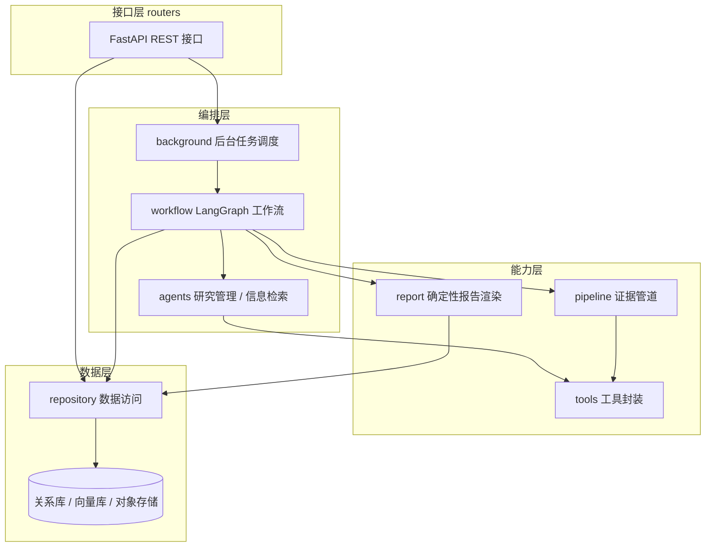
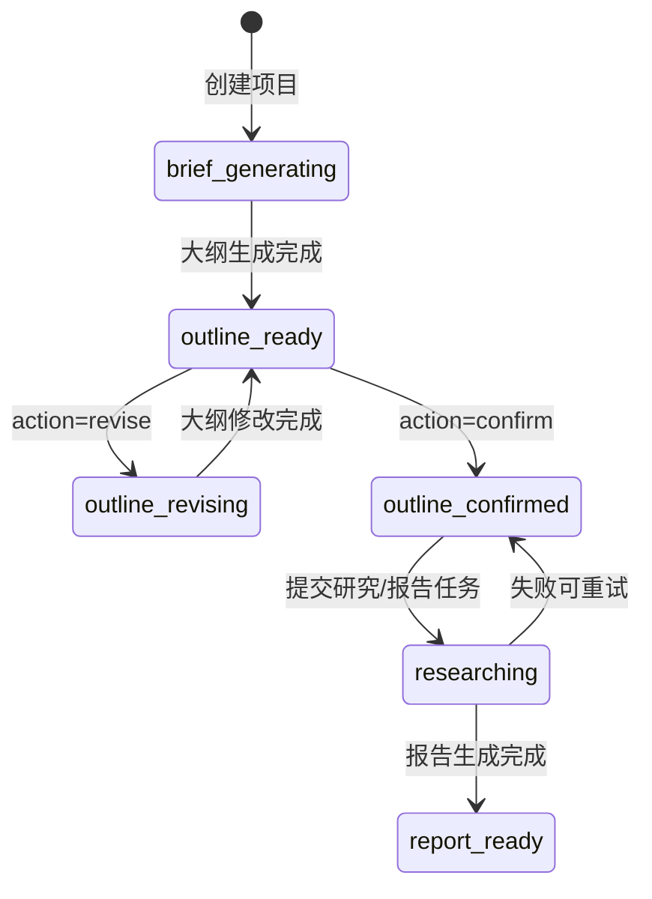
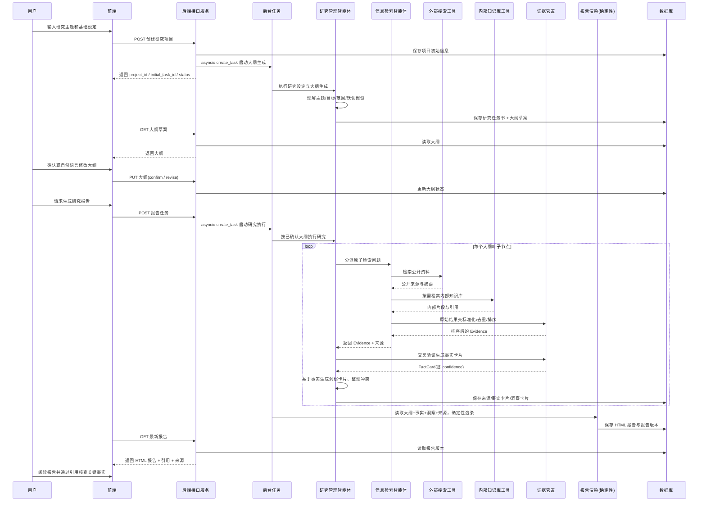
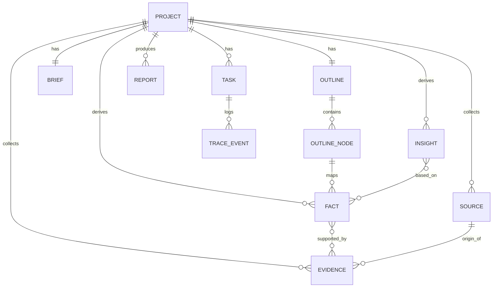

# 企业级深度搜索研究平台 — 概要设计与技术方案

> 版本：v1.0  
> 定位：把"人类研究员查资料、筛证据、写报告"的过程自动化，从一个模糊的研究问题出发，产出**可追溯、带引用、可评测**的研究报告。

---

## 0. 文档导读（大纲）

| 章节 | 内容 | 读者 |
| --- | --- | --- |
| 1 | 项目背景与目标、与 RAG/Agent 的边界 | 全员 |
| 2 | 总体架构：分层、核心流水线、状态机、时序图、技术选型 | 架构/后端 |
| 3 | 后端模块设计（模块职责表 + 详述） | 后端 |
| 4 | 数据模型设计（实体关系 + Evidence Schema） | 后端/数据 |
| 5 | 接口设计（完整 REST 契约） | 后端/前端 |
| 6 | 核心子系统：多智能体、LangGraph 编排、检索路由、证据管道、交叉验证、报告生成 | 算法/后端 |
| 7 | 评测体系 | 算法/QA |
| 8 | 可观测性与排障 | 后端/运维 |
| 9 | 部署与扩展性 | 运维/架构 |
| 10 | 里程碑与开发计划 | PM/全员 |

配套代码骨架见 `app/` 目录，README 描述了目录与运行方式。

---

## 1. 项目背景与目标

### 1.1 业务定位

普通搜索解决的是「问一个问题 → 返回一堆网页/文档」；本平台解决的是「给一个复杂研究任务 → 自动拆问题 → 多源检索 → 阅读 → 抽证据 → 去重排序 → 交叉验证 → 生成带引用的报告」。

它不是一个更聪明的搜索框，而是一个**研究型 Agent 工作流**。在传统研究流程里，下列环节最耗费人力，也正是本平台要自动化的部分：

1. 基于研究问题确定研究报告大纲；
2. 基于各段落收集资料、构建事实链条；
3. 基于事实链条构建洞察；
4. 把各段落组织成一份完整、可追溯的报告。

### 1.2 与普通搜索 / RAG / 普通 Agent 的区别

平台的核心区别在于「围绕一个复杂问题持续查资料、筛证据、验证结论、生成报告」，而不是一次性问答。

| 维度 | 普通 RAG | 普通 Agent | 深度搜索（本平台） |
| --- | --- | --- | --- |
| 输入 | 一个问题 | 一个任务 | 一个复杂研究任务 |
| 检索 | 一次向量检索 | 动态调工具 | 多轮、多源、多子问题检索 |
| 数据源 | 多为私域库 | 工具结果 | 公网 + 私域 + 数据库 + 工具 |
| 输出 | 一段答案 | 动作结果 | 结构化、带引用的报告 |
| 中间过程 | 不可见 | 部分可见 | 有计划、证据、trace 全程可见 |
| 证据处理 | TopK chunk | 无统一抽象 | Evidence Pipeline |
| 评测 | answer faithfulness | — | 检索/引用/报告/结论多维评测 |
| 核心资产 | Prompt + 向量库 | Prompt + Tools | Evidence Pipeline + Workflow + Eval |

一句话定位：

```
搜索引擎：帮人找到网页。
RAG：     帮模型从知识库里找资料回答问题。
Agent：    帮模型调用工具完成任务。
深度搜索： 让 Agent 像研究员一样，围绕复杂问题持续查证、验证、写报告。
```

### 1.3 设计目标与非目标

**设计目标（本期）**

- 端到端跑通主链路：`创建项目 → 生成大纲 → 人工确认 → 执行研究 → 生成报告`。
- 多源检索（公网 + 内部知识库）统一为 `Evidence`，并支持去重、排序、交叉验证。
- 报告**确定性生成**：结论必须挂载证据引用，可点击溯源。
- 全链路 `trace`，每个节点的输入输出、耗时、token 消耗、证据来源可查。

**非目标（本期不做）**

- 实时流式会议助手、长时记忆个性化。
- 在第一版请求中暴露 `knowledge_mode`：系统默认查询内部知识库，由智能体判断内部结果是否与当前研究问题相关、是否进入报告。
- 报告生成**不使用独立的「报告生成智能体」**（见 §6.6，这是本期相对早期设计的一个重要调整）。

---

## 2. 总体架构

### 2.1 系统分层架构

平台采用「接口层 — 编排层 — 能力层 — 数据层」四层结构。后端通过 FastAPI 暴露接口；研究执行是一个长耗时过程，放在后台任务中异步驱动 LangGraph 工作流；工作流内部由智能体做决策、由工具提供外部能力、由证据管道做标准化与质检；所有产物落库，报告生成从库里读数据按确定性流程渲染。



### 2.2 核心研究流水线

平台最关键的技术资产不是「会调用搜索 API」，而是这条流水线：

```
Plan → Search → Read → Evidence → Verify → Report → Evaluate
```

逐段映射到工作流节点（详见 §6.2）：

```mermaid
flowchart LR
    A[理解任务书 Brief] --> B[拆解子问题 Plan]
    B --> C[检索路由 Route]
    C --> D[多源检索 Search\n公网 / 私域]
    D --> E[网页文档解析 Read]
    E --> F[证据标准化 Normalize]
    F --> G[去重排序重排 Rank]
    G --> H[交叉验证 CrossCheck]
    H --> I[事实卡片 Fact]
    I --> J[洞察卡片 Insight]
    J --> K[报告组装 Report\n确定性渲染]
    K --> L[评测与 Trace Evaluate]
```



数据在链路中的抽象层级是逐级提炼的：`原始检索结果 → Evidence（证据） → FactCard（事实卡片） → InsightCard（洞察卡片） → Report（报告）`。这条「提炼链」是保证报告**每个结论可溯源**的关键。

### 2.3 业务状态机

研究项目和后台任务各有一套状态。项目状态描述研究生命周期，任务状态描述单次后台作业。

**项目状态（`project.status`）**



**任务状态（`task.status`）**：`queued → running → succeeded | failed`。

一个项目在生命周期内可能产生多个任务：大纲生成任务（`generate_research_brief`）、大纲修改任务（`revise_outline`）、报告/研究任务（`generate_report`）。前端通过 `task_id` 轮询任务进度。

### 2.4 系统调用时序图（修正版）

> 注意：相比早期设计，本期**取消了独立的「报告生成智能体」**。研究管理智能体与信息检索智能体只负责产出结构化数据（来源、事实卡片、洞察卡片）并落库；报告由确定性流程从库中读数据渲染（详见 §6.6）。



### 2.5 技术选型

| 关注点 | 选型 | 理由 |
| --- | --- | --- |
| Web 框架 | FastAPI + Uvicorn | 原生 async、Pydantic 校验、自动 OpenAPI 文档 |
| 数据校验 | Pydantic v2 | 接口契约与领域模型统一 |
| 工作流编排 | LangGraph | 显式状态机、可中断/恢复、节点级 trace，契合「强流程控制」诉求 |
| 局部决策 | ReAct / 结构化输出 | 在检索路由、事实/洞察合成等节点做受控的 LLM 决策 |
| 异步任务 | asyncio（本期）→ Celery/RQ（演进） | 本期用 `asyncio.create_task`，后续可平滑替换为独立队列 |
| 关系存储 | PostgreSQL | 项目/任务/证据/报告强一致存储 |
| 向量检索 | pgvector / Milvus | 内部知识库召回 |
| 重排 | Cross-Encoder Reranker | 语义重排，提升证据排序质量 |
| 可观测 | 结构化 trace 落库 + OpenTelemetry | 节点输入输出/耗时/token/证据来源全记录 |

> 骨架代码中关系库、向量库、LLM、搜索 API 均以**可替换的接口 + 内存/桩实现**给出，保证 `git clone` 后无需外部依赖即可跑通主链路；生产接入只需替换对应实现。

---

## 3. 后端模块设计

### 3.1 模块总览

| 模块 | 职责 | 关键文件 |
| --- | --- | --- |
| `routers` | HTTP 接口层：定义路由、做参数校验、调用 `repository` 落库或向 `background` 投递任务 | `health.py` `projects.py` `tasks.py` `reports.py` |
| `schemas` | Pydantic 出入参模型与领域模型，是系统对外/对内的契约 | `api.py`（请求/响应）`domain.py`（Evidence/Fact/Insight/Source/Outline/Brief） |
| `config` | 配置管理：环境变量、模型名、检索参数、各类阈值（去重、置信度等） | `config.py` |
| `background` | 后台异步任务调度：注册作业、用 `asyncio.create_task` 驱动工作流、回写任务状态 | `background.py` |
| `agents` | 智能体「大脑」：封装 LLM 决策逻辑（理解任务书、拆子问题、检索路由、合成事实/洞察） | `agents.py` |
| `tools` | 外部能力封装：Web 搜索、内部 RAG、网页解析、重排；统一适配为 `Evidence` 输出 | `base.py` `web_search.py` `rag_search.py` `page_extract.py` `rerank.py` |
| `pipeline` | 证据管道（**核心工程资产**）：标准化、去重、排序/重排、交叉验证 | `evidence_pipeline.py` `crosscheck.py` |
| `workflow` | LangGraph 编排：状态定义、节点实现、图装配 | `state.py` `nodes.py` `graph.py` |
| `report` | 报告渲染：从结构化数据按确定性模板生成带引用的 HTML | `report.py` |
| `repository` | 数据访问层：项目/任务/证据/报告的 CRUD，隔离存储细节 | `repository.py` |

> 相比早期设计文档，新增了 `workflow` 与 `pipeline` 两个模块并单独成层——它们是把「搜索 + 总结」升级为「研究工作流」的关键，不应混在 `agents` 里。

### 3.2 各模块职责详述

- **routers**：每个接口只做三件事——校验入参、调用一个 `repository`/`background` 方法、组织响应。**不在路由里写业务逻辑**。`PUT/POST` 类接口通过 `repository` 创建任务再投递后台队列；`GET` 类接口直接读状态。
- **schemas**：`domain.py` 定义领域核心对象（尤其是 `Evidence`，见 §4.3），`api.py` 定义每个接口的请求/响应。接口契约一旦定稿，前后端可并行开发。
- **agents**：只关心「在哪里用 LLM、怎么用」。每个决策点是一个纯函数 `state/输入 → 结构化输出`，便于单测与替换模型。明确**哪里不需要 LLM**（去重、排序、引用绑定、报告骨架渲染都不用）。
- **tools**：每个工具实现统一的 `BaseTool` 协议，输出统一适配为 `Evidence`，并内置失败 `fallback`。Agent 只面向工具协议编程，不关心底层是哪家搜索 API。
- **pipeline**：把不同来源的异构结果收敛成可去重、可排序、可验证、可引用的证据集合。**没有 Evidence Schema，深度搜索就只是「搜索 + 总结」。**
- **workflow**：用 LangGraph 把「计划→检索→证据→验证→报告」固化为可中断、可恢复、可观测的状态机。失败时能从断点恢复，每步输入输出清晰。

---

## 4. 数据模型设计

### 4.1 实体关系



### 4.2 核心实体定义

| 实体 | 关键字段 | 说明 |
| --- | --- | --- |
| `Project` | `id, topic, research_goal, target_audience, region_scope, time_scope, status, created_at` | 全局研究项目，贯穿生命周期 |
| `Task` | `id, project_id, task_type, status, message, created_at, updated_at` | 一次后台作业 |
| `Brief` | `project_id, topic, objective, scope, default_assumptions[]` | 研究任务书（智能体对任务的理解） |
| `OutlineNode` | `node_id, title, question, description, children[]` | 大纲节点，支持多级嵌套 |
| `Source` | `id, project_id, title, url, published_at, source_type` | 来源（公网/内部），报告引用的落点 |
| `Evidence` | 见 §4.3 | 证据，平台的「universal schema」 |
| `FactCard` | `id, node_id, claim, supporting_evidence_ids[], confidence` | 被证据支撑的事实 |
| `InsightCard` | `id, node_id, insight, based_on_fact_ids[], implication, confidence` | 基于事实的综合洞察 |
| `Report` | `id, project_id, version, title, html, source_ids[], created_at` | 报告版本（可多版本） |
| `TraceEvent` | `task_id, node, input_summary, output_summary, latency_ms, token_usage, ts` | 链路观测事件 |

### 4.3 Evidence Schema（核心）

不同来源数据格式各异（网页 `title/url/content`、知识库 `doc_id/chunk_id/score/text`、数据库 `table/row/metric`、PDF `page/paragraph/bbox`）。证据标准化就是把它们**全部收敛成同一个结构**，因为后续去重、排序、引用绑定、事实核查、报告生成、评测统计、trace 追踪**全部依赖它**。

```json
{
  "evidence_id": "ev_001",
  "source_type": "public_web",        // public_web | internal_kb | database | file
  "source_id": "src_010",             // 关联 Source
  "title": "文章标题",
  "url": "https://example.com",
  "content": "清洗后的正文片段",
  "quote": "支撑结论的关键摘录（短）",
  "published_at": "2026-05-01",
  "retrieved_at": "2026-06-05T08:01:00Z",
  "scores": {
    "relevance": 0.86,                // 与子问题相关性
    "credibility": 0.70,              // 来源可信度
    "freshness": 0.90,                // 时间新鲜度
    "diversity": 0.50,                // 来源多样性贡献
    "rerank": 0.81,                   // 重排模型语义分
    "final": 0.83                     // 综合分（加权融合）
  },
  "question_id": "q_1.2_03",          // 服务于哪个原子问题
  "node_id": "1.2"                    // 归属大纲节点
}
```

综合分采用可配置加权融合（§6.4）：

```
final = w_rel*relevance + w_cred*credibility + w_fresh*freshness
      + w_div*diversity + w_rerank*rerank
```

---

（接 `02-接口与子系统设计.md`：完整接口设计与核心子系统设计）
