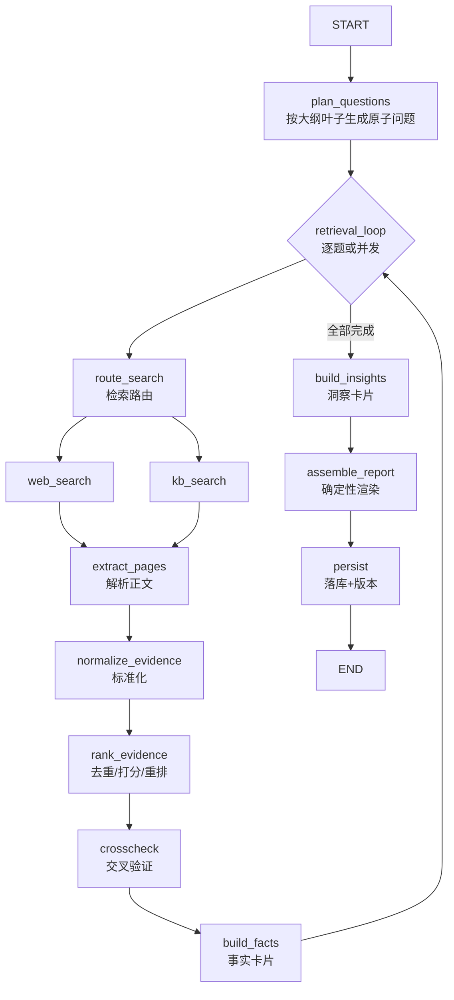

# 接口与核心子系统设计

> 接 `01-概要设计与技术方案.md`。本篇覆盖：完整接口契约（§5）、核心子系统设计（§6）、评测体系（§7）、可观测性（§8）、部署与扩展（§9）、里程碑（§10）。

---

## 5. 接口设计

### 5.1 接口总览

| 接口 | 方法 | 用途 |
| --- | --- | --- |
| `/health` | GET | 健康检查 |
| `/api/v1/research-projects` | POST | 创建研究项目，自动触发大纲生成 |
| `/api/v1/research-projects/{project_id}/outline` | GET | 获取大纲草案 |
| `/api/v1/research-projects/{project_id}/outline` | PUT | 确认 / 自然语言修改大纲 |
| `/api/v1/research-projects/{project_id}/report-tasks` | POST | 提交报告生成（研究执行）任务 |
| `/api/v1/tasks/{task_id}` | GET | 查询任务状态 |
| `/api/v1/research-projects/{project_id}/reports/latest` | GET | 获取最新报告 |
| `/api/v1/research-projects/{project_id}/evidence` | GET | （扩展）查看证据列表，按 node 过滤 |
| `/api/v1/tasks/{task_id}/trace` | GET | （扩展）查看任务执行 trace |

### 5.2 接口详细定义

#### 5.2.1 创建研究项目 `POST /api/v1/research-projects`

请求：

```json
{
  "topic": "研究具身智能行业未来三年的机会",
  "research_goal": "判断公司是否需要关注该行业",
  "target_audience": "公司战略团队",
  "region_scope": "china",
  "time_scope": { "type": "recent_years", "years": 3 }
}
```

字段说明：`region_scope` 支持 `china | overseas | global`；`time_scope.type` 支持 `recent_years | unlimited`，前者用 `years` 表示近 N 年。第一版请求**不提供** `knowledge_mode`——系统默认查内部库，由智能体判断内部结果是否相关、是否进入报告。

响应：

```json
{
  "project_id": "proj_xxx",
  "initial_task_id": "task_xxx",
  "initial_task_type": "generate_research_brief",
  "topic": "研究具身智能行业未来三年的机会",
  "status": "brief_generating",
  "next_step": "wait_for_outline",
  "created_at": "2026-06-05T08:00:00Z"
}
```

要点：创建后后端**自动**创建大纲生成任务，前端无需单独调用大纲生成接口。`project_id` 贯穿全生命周期；`initial_task_id` 用于查询大纲生成任务状态。大纲生成完成后 `status` 变为 `outline_ready`。

#### 5.2.2 获取大纲草案 `GET /api/v1/research-projects/{project_id}/outline`

响应（节选）：

```json
{
  "project_id": "proj_xxx",
  "status": "outline_ready",
  "outline": [
    {
      "node_id": "1",
      "title": "行业定义和研究边界",
      "question": "本报告讨论的具身智能具体指什么",
      "description": "明确行业定义、研究对象和不覆盖的边界",
      "children": [
        { "node_id": "1.1", "title": "行业定义", "question": "具身智能和传统机器人、通用人工智能有什么区别", "description": "说明核心概念、技术边界和典型应用形态", "children": [] },
        { "node_id": "1.2", "title": "研究范围", "question": "本报告覆盖哪些地区、时间范围和应用场景", "description": "说明地域/时间/场景边界", "children": [] }
      ]
    },
    { "node_id": "2", "title": "市场规模和增长驱动", "question": "行业未来三年是否存在足够大的增长空间", "description": "分析市场规模、增速、核心驱动与不确定性", "children": [] }
  ]
}
```

字段：`node_id` 用于前端展开/定位/编辑；`question` 是该章节要回答的核心问题；`description` 是写作说明；`children` 支持多级嵌套。

#### 5.2.3 保存已确认大纲 `PUT /api/v1/research-projects/{project_id}/outline`

直接确认：

```json
{ "action": "confirm" }
```

自然语言修改：

```json
{ "action": "revise", "revision_instruction": "把竞争格局单独拆成一章，并增加头部公司的产品对比" }
```

确认时响应：`{ "project_id": "...", "status": "outline_confirmed", "next_step": "generate_report" }`

修改时响应：`{ "project_id": "...", "revision_task_id": "...", "status": "outline_revising", "next_step": "wait_for_outline" }`

说明：`confirm` → `outline_confirmed`；`revise` → 启动修改任务，`outline_revising`，完成后回到 `outline_ready`，前端继续 `GET outline` 取最新版。

#### 5.2.4 提交报告生成任务 `POST /api/v1/research-projects/{project_id}/report-tasks`

请求：`{ "user_instruction": "报告风格偏管理层汇报，结论要明确" }`

响应：`{ "task_id": "...", "project_id": "...", "task_type": "generate_report", "status": "queued" }`

#### 5.2.5 查询任务状态 `GET /api/v1/tasks/{task_id}`

响应：

```json
{
  "task_id": "task_xxx",
  "project_id": "proj_xxx",
  "task_type": "generate_report",
  "status": "running",
  "message": "正在检索公开资料",
  "created_at": "2026-06-05T08:00:00Z",
  "updated_at": "2026-06-05T08:03:00Z"
}
```

#### 5.2.6 获取最新报告 `GET /api/v1/research-projects/{project_id}/reports/latest`

响应：

```json
{
  "project_id": "proj_xxx",
  "report_id": "rep_xxx",
  "version": 1,
  "title": "具身智能行业机会研究报告",
  "html": "<html>报告正文</html>",
  "sources": [
    { "title": "来源标题", "url": "https://example.com/report", "published_at": "2026-01-01", "source_type": "public_web" }
  ],
  "created_at": "2026-06-05T08:30:00Z"
}
```

### 5.3 编码落地步骤

1. `schemas` 模块定义接口出入参 `BaseModel`；
2. `routers` 模块定义路由函数；
3. 实现路由逻辑：`PUT/POST` 通过 `repository` 创建任务并投递后台队列；`GET` 通过 `repository` 读状态。

---

## 6. 核心子系统设计

### 6.1 多智能体架构

本期采用**双智能体 + 确定性报告渲染**：

- **研究管理智能体（Research Manager / Orchestrator）**：编排者。输入「已确认大纲」，对每个叶子节点生成原子检索问题，分派给检索智能体，回收 `Evidence`，做交叉验证生成事实卡片，再基于事实合成洞察卡片、整理冲突，最后落库。
- **信息检索智能体（Retrieval Agent）**：执行者。输入一个原子检索问题，决定检索路由（公网/内部/两者），调用工具检索与解析，输出 `Evidence` 列表与来源。

> 报告生成**不再是独立智能体**：研究阶段只产结构化数据，报告由 §6.6 的确定性流程渲染，保证「结构稳定、引用准确、可复算」。

职责切分原则——**哪里用 LLM**：

| 环节 | 用 LLM？ | 说明 |
| --- | --- | --- |
| 任务理解 / 大纲生成 | ✅ | 把模糊问题结构化 |
| 子问题拆解 | ✅ | 生成原子检索问题 |
| 检索路由判断 | ✅（可降级为规则） | 判断查公网/内部 |
| 网页正文抽取 | ❌（规则/解析库）+ ✅摘要可选 | 解析为主，必要时 LLM 压缩 |
| 证据去重 | ❌ | URL/内容指纹 + 可选语义聚类 |
| 证据排序 / 重排 | ❌融合打分 + ✅Reranker | 打分确定性，重排用模型分 |
| 交叉验证 | ✅ | 判断证据是否支撑结论 |
| 事实 / 洞察合成 | ✅ | 结构化生成 |
| 引用绑定 | ❌ | 确定性映射 fact→evidence→source |
| 报告骨架渲染 | ❌ | 模板渲染；段落文字可选 LLM |

### 6.2 LangGraph 工作流编排

平台有两条主要图：**大纲图**与**研究执行图**。

**大纲生成图**（任务 `generate_research_brief` / `revise_outline`）：

```
START → understand_brief → generate_outline → END
```

**研究执行图**（任务 `generate_report`）：



设计要点：

- **状态显式**：所有中间产物（questions/evidences/facts/insights/sources/report_html/errors/trace）都在 `ResearchState` 里，便于断点恢复。
- **可中断可恢复**：每个节点执行后写 trace 与 checkpoint，失败可从最近成功节点重启，无需从头重跑检索。
- **检索子图可并发**：`route_search → search → extract → normalize → rank → crosscheck` 是一个可复用子图，多个原子问题可并行执行（受并发上限约束）。

### 6.3 检索路由与多源检索

不同子问题去不同地方查，工程上是一个 Router：

| 子问题类型 | 检索方式 |
| --- | --- |
| 最新行业趋势 | 公网搜索 |
| 公司内部资料 | 私域知识库（向量 + BM25） |
| 结构化经营数据 | SQL 查询 |
| 技术方案对比 | 公网 + 私域文档 |
| 历史经验总结 | 内部知识库 |
| 最终建议 | 证据综合（不检索） |

```
问题 → 判断类型（LLM 或规则）→ 选择工具集 → 并发检索 → 汇总
```

多源检索同时做：`Web Search`（公网最新）、`Vector Search`（私域语义）、`BM25`（关键词强匹配）、`SQL`（结构化）、`File Search`（上传文件）。这正是与普通 RAG（一次向量检索）的区别：**先拆子问题，每个子问题多源检索，再汇总证据**。

### 6.4 证据管道（Evidence Pipeline）

管道把异构结果收敛成高质量证据集合，分四步：

**(1) 标准化 Normalize**：把工具原始结果适配为 `Evidence`；统一清洗正文（去广告/导航/脚本）、解析发布时间、抽取关键摘录 `quote`、过长内容压缩。很多系统质量差，就是因为只拿了 snippet，没真正读网页。

**(2) 去重 Dedup**：URL 归一 + 内容指纹（SimHash/MinHash）做精确去重；可选语义聚类去近似重复。

**(3) 排序 Rank**：企业里不能把所有结果塞给 LLM，要排序、过滤。综合分由多因子加权融合，工程上结合 `Dense Search / BM25 / RRF / Reranker / Rule Filter / LLM Judge`：

| 分量 | 含义 |
| --- | --- |
| `relevance` | 与问题相关性 |
| `credibility` | 来源可信度（域名白名单/权威度） |
| `freshness` | 时间新鲜度（按 `time_scope` 衰减） |
| `diversity` | 来源多样性（同源降权，MMR） |
| `rerank` | 重排模型语义分 |

```
final = Σ wᵢ · scoreᵢ          # 权重可配置
保留 TopN，按节点配额分配
```

**(4) 输出**：每个原子问题产出一组有序、去重、带分数与溯源信息的 `Evidence`。

### 6.5 交叉验证（Cross-Check）

深度搜索最怕「报告很完整，但结论没有证据支持」。CrossCheck 在事实卡片生成时强制校验：

| 检查项 | 说明 |
| --- | --- |
| 每个结论是否有证据 | 无证据不能写死，需标注"信息不足" |
| 引用是否真支撑结论 | 不能挂错引用 |
| 多来源是否一致 | 避免单一来源误导 |
| 是否有冲突信息 | 有冲突要在报告中提示 |
| 信息是否过时 | 旧数据不能当新结论 |
| 是否需要拒答 | 证据不足要说不确定 |

事实卡片结构：

```json
{
  "claim": "企业办公 Agent 的高价值场景包括行政、人事、财务和客服。",
  "supporting_evidence": ["ev_001", "ev_004", "ev_009"],
  "confidence": 0.84,
  "conflicts": []
}
```

置信度低于阈值（如 `0.5`）的事实不进入结论，或以"待验证"呈现；存在冲突时报告显式列出分歧来源。

### 6.6 报告生成（确定性流程）

> **关键设计决策**：报告生成不使用独立智能体，而是从库里读取「大纲 + 事实卡片 + 洞察卡片 + 来源」，按确定性流程渲染 HTML。这样保证报告结构稳定、引用准确、可复算、可 diff。

流程：

```
读取(大纲, facts, insights, sources)
  → 按大纲节点组织内容（每节点挂其 facts/insights）
  → 生成执行摘要（可选 LLM，仅基于已验证 facts/insights，受控）
  → 绑定引用（fact→evidence→source，确定性映射，生成可点击角标）
  → 渲染 HTML（模板）
  → 附录：来源列表 + 证据表
  → 落库 + 生成新版本号
```

报告标准结构：

```
1. 执行摘要      2. 研究范围      3. 关键发现
4. 详细分析      5. 竞品/方案对比  6. 风险与限制
7. 建议行动      8. 引用来源      9. 附录：证据表
```

引用绑定是确定性的：每条结论文字后挂 `[n]` 角标，`n` 指向 `sources[n]`，点击可跳转原始 URL/内部文档，实现「通过引用核查关键事实」。

---

## 7. 评测体系

平台要能回答「它到底有没有比普通 RAG 更好、改了策略有没有提升、引用是否真准」。评测分三层：

| 层 | 指标 | 说明 |
| --- | --- | --- |
| 检索 | `Recall@K`、`MRR`、`nDCG` | 召回与排序质量 |
| 证据/引用 | `Citation Accuracy`、`Claim Support Rate`、`Faithfulness` | 引用是否准、结论是否被证据支撑、是否忠于来源 |
| 报告 | `Report Completeness`、`Conflict Coverage` | 大纲覆盖度、冲突是否被指出 |
| 系统 | `Latency`、`Cost`（token） | 时延与成本 |

评测数据来自 `trace`，可做离线回归（固定问题集）与在线抽检（人工标注）。每次策略变更（检索权重、Reranker、Prompt）都跑回归对比。

---

## 8. 可观测性与排障

每个任务记录完整 `trace`，用于回答「为什么报告质量差 / 为什么没搜到关键资料 / 为什么引用错 / 哪个节点最慢 / 成本花在哪」：

- 每个节点的输入摘要、输出摘要、耗时、token 消耗；
- 每个工具调用的请求/返回/是否 fallback；
- 每条证据的来源与各项分数；
- 每个错误的节点与原因。

trace 落库并提供 `GET /api/v1/tasks/{task_id}/trace`；接入 OpenTelemetry 可与全链路监控打通。

---

## 9. 部署与扩展性

- **本期**：单体 FastAPI + `asyncio` 后台任务 + 内存/桩存储，便于本地起步与联调。
- **演进**：
  - 后台任务从 `asyncio.create_task` 迁移到 Celery/RQ 独立 worker，支持横向扩容与重试；
  - 存储替换为 PostgreSQL（关系）+ pgvector/Milvus（向量）+ 对象存储（报告/原文）；
  - 工具层接真实 Web 搜索 API、企业知识库、SQL 网关；
  - 工作流加入 checkpoint 持久化，支持长任务断点续跑；
  - 多租户隔离与配额、内容合规过滤。

扩展点都收敛在接口背后：新增数据源 = 新增一个 `Tool` + 在路由表登记；新增报告板式 = 新增一个 renderer 模板。

---

## 10. 里程碑与开发计划

| 阶段 | 目标 | 主要产出 |
| --- | --- | --- |
| M1 骨架 | 接口契约 + 工作流跑通（桩） | schemas / routers / 内存 repo / 工作流空跑 |
| M2 检索与证据 | 多源检索 + Evidence Pipeline | tools / pipeline / 去重排序 |
| M3 合成与报告 | 事实/洞察 + 确定性报告 | agents 合成 / crosscheck / report 渲染 |
| M4 评测与观测 | trace + 评测回归 | trace 落库 / eval 脚本 / 看板 |
| M5 生产化 | 真实数据源 + 队列 + 持久化 | Celery / Postgres / 向量库 / 合规 |

---

工程师在这个项目里实际开发的，就是这条链路上的各个模块：**后端接口、LangGraph 工作流、工具封装、证据管道、数据模型、评测体系、可观测与排障**。最关键的资产不是"会调搜索 API"，而是把 `Plan → Search → Read → Evidence → Verify → Report → Evaluate` 工程化、可追踪、可评测、可扩展。
