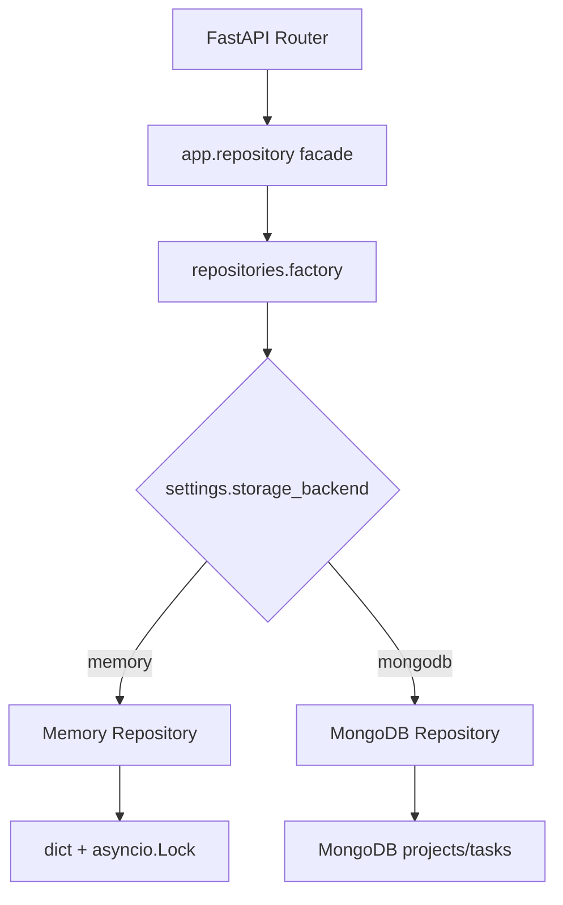
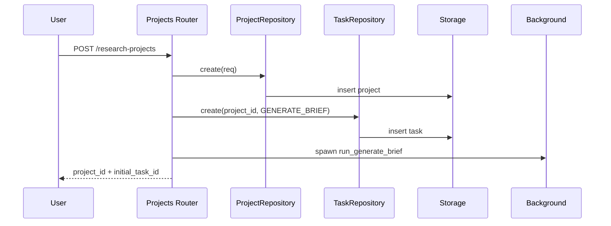
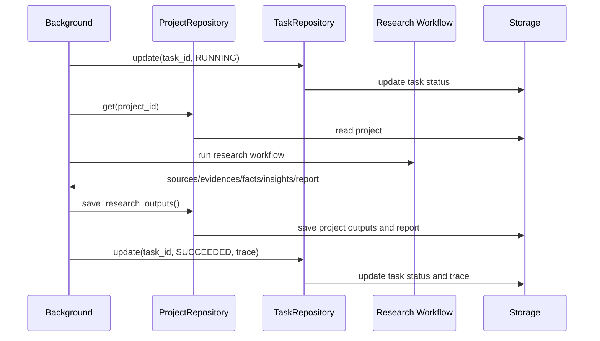

# MongoDB 存储实现方案

## 1. 改造目标

当前项目使用进程内内存存储，适合阶段一演示和单元测试，但服务重启后数据会丢失，也不适合多进程部署。本次改造目标是引入 MongoDB 持久化存储，同时保留原有内存模式。

核心原则：

- API 路由层不直接操作数据库。
- 后台任务和工作流不感知底层存储类型。
- 默认仍使用 `memory`，保证本地开发和测试零外部依赖。
- 通过配置切换到 `mongodb`，默认连接本地 MongoDB。
- 存储实现按企业工程边界拆分，便于文档总结、流程图和后续扩展。

## 2. 当前实现方式

当前存储集中在 `app/repository.py`：

```text
app/repository.py
├── ProjectRecord
├── TaskRecord
├── _Store
│   ├── projects: dict
│   ├── tasks: dict
│   └── lock: asyncio.Lock
├── ProjectRepository
├── TaskRepository
├── project_repo
└── task_repo
```

业务层调用方式：

```python
from app.repository import project_repo, task_repo
```

路由、后台任务只依赖 `project_repo` / `task_repo` 的方法契约，这为替换底层存储提供了边界。

## 3. 企业工程方案对比

| 方案 | 说明 | 优点 | 缺点 | 结论 |
|---|---|---|---|---|
| 直接把 `app/repository.py` 改成 MongoDB | 原类内部改为 MongoDB 操作 | 改动文件少 | 丢失内存模式；单测依赖 MongoDB；职责继续集中 | 不推荐 |
| 保留内存实现，新增 MongoDB 实现，配置切换 | `memory.py` / `mongodb.py` 双实现 | 可回滚；可测试；API 不变 | 多几个文件 | 推荐 |
| 增加 Protocol 接口约束 | `base.py` 定义仓储契约 | 类型边界清晰，便于长期演进 | 初期略多样板 | 推荐 |
| 完整 DAO + Service + Repository 分层 | 进一步拆 service/dao | 标准化强 | 当前阶段过度设计 | 后期再做 |

最终采用：

```text
Repository Protocol + Memory Repository + MongoDB Repository + Factory
```

## 4. 目标目录结构

```text
app/
├── config.py
├── repository.py
└── repositories/
    ├── __init__.py
    ├── base.py
    ├── models.py
    ├── memory.py
    ├── mongodb.py
    ├── factory.py
    └── testing.py
```

职责说明：

| 文件 | 职责 |
|---|---|
| `base.py` | 定义 `ProjectRepositoryProtocol` / `TaskRepositoryProtocol` |
| `models.py` | 定义 `ProjectRecord` / `TaskRecord` 存储聚合对象 |
| `memory.py` | 原内存存储实现，适合本地开发和默认测试 |
| `mongodb.py` | MongoDB 持久化实现，负责序列化、反序列化和集合读写 |
| `factory.py` | 根据 `settings.storage_backend` 装配具体实现 |
| `testing.py` | 统一测试清理入口 |
| `repository.py` | 兼容旧 import 的 facade |

## 5. 配置设计

配置统一通过 `pydantic-settings` 读取：

```text
DEEPSEARCH_STORAGE_BACKEND=memory
DEEPSEARCH_MONGODB_URI=mongodb://127.0.0.1:27017
DEEPSEARCH_MONGODB_DB=deepsearch
DEEPSEARCH_MONGODB_PROJECTS_COLLECTION=projects
DEEPSEARCH_MONGODB_TASKS_COLLECTION=tasks
```

默认值：

```text
storage_backend = memory
mongodb_uri = mongodb://127.0.0.1:27017
mongodb_db = deepsearch
```

运行时切换：

```bash
DEEPSEARCH_STORAGE_BACKEND=mongodb uvicorn app.main:app
```

## 6. MongoDB 集合设计

阶段一使用两个集合：

```text
deepsearch.projects
deepsearch.tasks
```

### projects 文档

```json
{
  "id": "proj_xxx",
  "topic": "具身智能行业未来三年的机会",
  "research_goal": "判断公司是否需要关注该行业",
  "target_audience": "公司战略团队",
  "region_scope": "china",
  "time_scope": {
    "type": "recent_years",
    "years": 3
  },
  "status": "outline_ready",
  "created_at": "2026-06-12T10:00:00Z",
  "brief": {},
  "outline": [],
  "sources": [],
  "evidences": [],
  "facts": [],
  "insights": [],
  "reports": []
}
```

### tasks 文档

```json
{
  "id": "task_xxx",
  "project_id": "proj_xxx",
  "task_type": "generate_report",
  "status": "running",
  "message": "正在检索与分析资料",
  "created_at": "2026-06-12T10:00:00Z",
  "updated_at": "2026-06-12T10:01:00Z",
  "trace": []
}
```

### 索引建议

```text
projects.id unique
projects.status
tasks.id unique
tasks.project_id
tasks.status
tasks.created_at
```

## 7. 数据流程图



## 8. 创建项目流程



## 9. 报告生成流程



## 10. 序列化策略

MongoDB 存储 dict，业务层使用 dataclass 和 Pydantic model，因此需要集中转换：

```text
Pydantic model -> model_dump(mode="json")
Enum           -> value
datetime       -> datetime 或 ISO string
dict/list      -> 递归保存
```

反序列化：

```text
status    -> ProjectStatus(...)
task_type -> TaskType(...)
brief     -> ResearchBrief(**dict)
outline   -> OutlineNode(**dict)
sources   -> Source(**dict)
evidences -> Evidence(**dict)
reports   -> Report(**dict)
trace     -> TraceEvent(**dict)
```

## 11. 测试与回滚

默认测试仍走内存：

```bash
python -m unittest discover -s tests
```

MongoDB 模式测试：

```bash
DEEPSEARCH_STORAGE_BACKEND=mongodb \
DEEPSEARCH_MONGODB_DB=deepsearch_test \
python -m unittest discover -s tests
```

回滚：

```bash
DEEPSEARCH_STORAGE_BACKEND=memory
```

由于 API 层和后台任务只依赖仓储接口，切回内存模式不需要修改业务代码。
