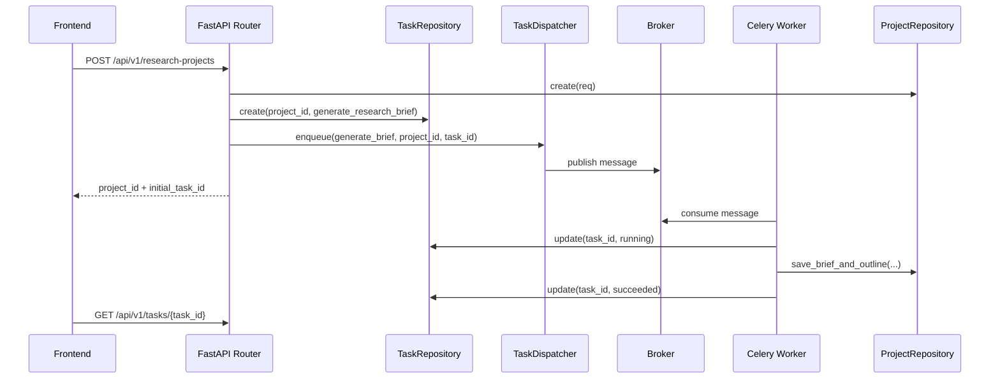

# Celery 后台任务改造方案

## 1. 一句话定位

Celery 改造的目标是把当前 API 进程内的 `asyncio.create_task` 后台执行，升级为独立 worker + 可靠队列的企业工程任务系统，同时保持现有 HTTP API、`task_id` 轮询方式和仓储接口基本不变。

## 2. 背景与目标

### 2.1 当前任务请求方式

当前链路是：

```text
Frontend
  -> FastAPI Router
  -> task_repo.create(status=queued)
  -> background.spawn(asyncio.create_task)
  -> run_generate_brief / run_revise_outline / run_generate_report
  -> task_repo.update(status=succeeded/failed)
  -> Frontend GET /tasks/{task_id}
```

这个设计适合 MVP：

- 接口立即返回 `task_id`，不会阻塞 HTTP 请求。
- 前端可以通过 `/tasks/{task_id}` 轮询。
- 后台任务逻辑集中在 `app/background.py`。
- 后续替换任务执行方式时，Router 层改动较少。

但它不是企业生产级任务系统：

- API 进程重启会导致正在执行的协程丢失。
- 多 API 实例下，任务只存在某个实例的事件循环里。
- 缺少队列积压、worker 扩容、自动重试、超时控制和死信处理。
- 任务无法跨进程调度，也不适合长时间 LLM / 搜索 / 报告生成任务。

### 2.2 改造目标

- 保持 API 协议不变：提交任务仍返回 `task_id`。
- 保持前端交互不变：继续轮询 `/api/v1/tasks/{task_id}`。
- 将任务执行从 API 进程迁移到 Celery worker。
- 任务状态仍由 `task_repo` 写入 MongoDB。
- 支持重试、超时、队列路由、worker 横向扩容。
- 为后续任务取消、优先级、限流和可观测性预留字段。

### 2.3 非目标

- 不把业务状态直接依赖 Celery result backend。
- 不让前端感知 Celery task id。
- 不在第一阶段引入复杂工作流平台。
- 不一次性改造所有 trace、审计和权限能力。

## 3. 当前方案与企业方案对比

| 维度 | 当前 `asyncio.create_task` | Celery 企业方案 |
|---|---|---|
| 执行位置 | FastAPI API 进程内 | 独立 worker 进程 |
| 队列能力 | 无队列，只是提交到事件循环 | Redis/RabbitMQ broker 持久排队 |
| 进程重启 | 正在跑的任务丢失 | 未消费任务仍在 broker，失败任务可重试 |
| 横向扩展 | API 实例越多，任务越分散 | API 和 worker 可独立扩容 |
| 重试 | 业务代码手动处理 | Celery 内建 retry/backoff/max_retries |
| 超时 | 需要手写 `asyncio.wait_for` | soft/hard time limit |
| 限流 | 无统一控制 | queue、worker concurrency、rate limit |
| 可观测性 | task message + trace | worker 日志、队列积压、任务事件、Prometheus |
| 运维复杂度 | 低 | 需要 broker、worker、监控和部署配置 |
| 适用阶段 | MVP / 单机演示 | 企业生产 / 多实例部署 |

结论：API 协议和业务状态机保留，任务投递和执行基础设施替换。

## 4. 总体架构

```text
Frontend
  -> FastAPI API
      -> project_repo / task_repo 写 MongoDB
      -> TaskDispatcher.enqueue(...)
  -> Broker Redis/RabbitMQ
  -> Celery Worker
      -> task_repo.update(running)
      -> ResearchManagerAgent / Workflow / Tools
      -> project_repo.save_*
      -> task_repo.update(succeeded/failed)
  -> Frontend GET /tasks/{task_id}
```

核心原则：

- MongoDB 保存业务任务状态，是前端查询的唯一来源。
- Celery 只负责调度和执行，不作为业务状态查询接口。
- Router 只创建任务和投递任务，不直接执行任务。
- Worker 复用原来的 `run_generate_brief`、`run_revise_outline`、`run_generate_report` 业务逻辑。

## 5. 模块设计

目标目录建议：

```text
app/
├── background.py                  # 对 Router 暴露兼容入口
├── task_dispatcher.py             # Dispatcher 抽象和选择逻辑
├── celery_app.py                  # Celery app 创建与配置
└── celery_tasks.py                # Celery task 定义
```

模块职责：

| 模块 | 职责 | 输入 | 输出 |
|---|---|---|---|
| `background.py` | 保留现有 `spawn` / 任务启动入口，降低 Router 改动 | project_id、task_id、instruction | 投递任务 |
| `task_dispatcher.py` | 根据配置选择 asyncio 或 celery | 任务名、参数 | enqueue 结果 |
| `celery_app.py` | 初始化 Celery、broker、队列、序列化、超时配置 | settings | celery app |
| `celery_tasks.py` | 定义 worker 可执行任务 | project_id、task_id | 执行业务协程 |
| `repositories/*` | 读写项目和任务状态 | record/model | MongoDB 文档 |

## 6. 数据流设计

### 6.1 创建项目并生成大纲



### 6.2 报告生成任务

```text
POST /research-projects/{project_id}/report-tasks
  -> 校验项目状态必须是 outline_confirmed 或 report_ready
  -> task_repo.create(project_id, generate_report)
  -> dispatcher.enqueue(generate_report, project_id, task_id, user_instruction)
  -> 返回 task_id
  -> Celery worker 执行研究工作流
  -> 保存 sources/evidences/facts/insights/report
  -> 更新任务状态
```

## 7. 配置设计

新增配置建议：

| 配置项 | 默认值 | 说明 |
|---|---|---|
| `DEEPSEARCH_TASK_BACKEND` | `asyncio` | 任务后端，可选 `asyncio` / `celery` |
| `DEEPSEARCH_CELERY_BROKER_URL` | `redis://127.0.0.1:6379/0` | Celery broker |
| `DEEPSEARCH_CELERY_RESULT_BACKEND` | `redis://127.0.0.1:6379/1` | Celery 结果后端，可选 |
| `DEEPSEARCH_CELERY_TASK_DEFAULT_QUEUE` | `deepsearch.default` | 默认队列 |
| `DEEPSEARCH_CELERY_WORKER_CONCURRENCY` | `2` | worker 并发 |
| `DEEPSEARCH_TASK_SOFT_TIME_LIMIT` | `900` | 软超时，单位秒 |
| `DEEPSEARCH_TASK_TIME_LIMIT` | `1200` | 硬超时，单位秒 |
| `DEEPSEARCH_TASK_MAX_RETRIES` | `2` | 最大重试次数 |

生产建议：

```text
DEEPSEARCH_STORAGE_BACKEND=mongodb
DEEPSEARCH_TASK_BACKEND=celery
DEEPSEARCH_CELERY_BROKER_URL=redis://redis:6379/0
DEEPSEARCH_CELERY_RESULT_BACKEND=redis://redis:6379/1
```

## 8. 代码改造方案

### 8.1 第一步：抽象 Dispatcher

新增 `TaskDispatcher`，把“投递任务”从 `background.spawn()` 中抽出来。

```python
class TaskDispatcher(Protocol):
    def generate_brief(self, project_id: str, task_id: str) -> None: ...
    def revise_outline(self, project_id: str, task_id: str, instruction: str) -> None: ...
    def generate_report(self, project_id: str, task_id: str, user_instruction: str) -> None: ...
```

保留两个实现：

| 实现 | 用途 |
|---|---|
| `AsyncioTaskDispatcher` | 本地开发、单元测试、无 Redis 环境 |
| `CeleryTaskDispatcher` | 生产和多实例部署 |

### 8.2 第二步：拆分业务执行函数

当前 `app/background.py` 里的函数已经具备比较好的边界：

```text
run_generate_brief(project_id, task_id)
run_revise_outline(project_id, task_id, instruction)
run_generate_report(project_id, task_id, user_instruction)
```

Celery worker 可以直接复用这些 async 函数，在同步 Celery task 内用 `asyncio.run(...)` 调用：

```python
@celery_app.task(name="deepsearch.generate_report")
def generate_report_task(project_id: str, task_id: str, user_instruction: str) -> None:
    asyncio.run(run_generate_report(project_id, task_id, user_instruction))
```

注意：如果后续 worker 内部需要复用已有事件循环，应改用 `asgiref.sync.async_to_sync` 或选择原生 async worker 方案。本项目第一版 Celery worker 用同步进程模型即可。

### 8.3 第三步：保持 Router 不变

Router 仍然调用：

```python
bg.spawn(bg.run_generate_report(project_id, task.id, req.user_instruction))
```

但更推荐在下一步改成更明确的兼容入口：

```python
bg.start_generate_report(project_id, task.id, req.user_instruction)
```

这样 `background.py` 可以根据配置选择：

```text
asyncio backend -> asyncio.create_task
celery backend  -> celery_app.send_task
```

Router 不需要关心具体执行方式。

### 8.4 第四步：补任务字段

当前 `TaskRecord` 字段为：

```text
id, project_id, task_type, status, message, created_at, updated_at, trace
```

Celery 化后建议逐步增加：

| 字段 | 说明 |
|---|---|
| `celery_task_id` | Celery 内部 task id，便于排查 worker 日志 |
| `attempt` | 当前尝试次数 |
| `max_retries` | 最大重试次数 |
| `started_at` | 实际开始执行时间 |
| `finished_at` | 结束时间 |
| `worker_id` | 执行该任务的 worker |
| `error_type` | 异常类型 |
| `error_detail` | 异常摘要 |
| `idempotency_key` | 幂等键，防重复提交 |

第一阶段可以只加 `celery_task_id`、`attempt`、`error_type`，不要一次性扩太多。

## 9. 任务状态机

当前状态保持：

```text
queued -> running -> succeeded
                 -> failed
```

企业增强状态建议：

```text
queued -> running -> retrying -> running -> succeeded
                 -> failed
                 -> timeout
                 -> cancelled
```

第一阶段不建议立刻扩状态枚举，否则前端和测试都要同步调整。可以先通过 `message`、`attempt`、`error_type` 表达 retry/timeout，稳定后再扩展状态机。

## 10. 可靠性设计

### 10.1 幂等

风险：用户重复点击“生成报告”，可能创建多个报告任务。

建议：

- API 层接受或生成 `idempotency_key`。
- 对 `project_id + task_type + idempotency_key` 建唯一索引。
- 对于报告任务，项目处于 `researching` 时拒绝再次提交。

### 10.2 重试

适合重试：

- 临时网络错误。
- 搜索 API 429 / 5xx。
- LLM 服务短暂不可用。
- MongoDB 瞬时连接异常。

不适合重试：

- 请求参数错误。
- 项目不存在。
- 大纲未确认。
- 数据结构不兼容。

建议按异常类型区分 retryable / non-retryable，不要所有异常无脑重试。

### 10.3 超时

建议配置：

```text
generate_research_brief: soft 120s, hard 180s
revise_outline: soft 120s, hard 180s
generate_report: soft 900s, hard 1200s
```

超时后：

- 更新 task 为 `failed` 或未来的 `timeout`。
- 把 project 从 `researching` 回退到 `outline_confirmed`。
- 记录 `error_type=TimeoutError`。

### 10.4 队列隔离

建议按任务类型拆队列：

| 队列 | 任务 | 特点 |
|---|---|---|
| `deepsearch.brief` | 大纲生成、修改大纲 | 耗时较短 |
| `deepsearch.report` | 报告生成 | 耗时长、成本高 |
| `deepsearch.default` | 兜底任务 | 默认 |

这样报告生成积压时，不会阻塞大纲生成。

## 11. 部署方案

最小生产拓扑：

```text
FastAPI API x N
Celery Worker x M
Redis or RabbitMQ
MongoDB
```

启动示例：

```bash
uvicorn app.main:app --host 0.0.0.0 --port 8000
```

```bash
celery -A app.celery_app.celery_app worker \
  --loglevel=INFO \
  --queues=deepsearch.brief,deepsearch.report,deepsearch.default \
  --concurrency=2
```

企业部署建议：

- API 服务和 worker 分开容器。
- Redis/RabbitMQ 使用托管或高可用部署。
- MongoDB 使用 replica set。
- worker 按队列和任务类型拆 Deployment。
- 报告生成 worker 单独限并发，避免 LLM 成本失控。

## 12. 可观测性

必须保留的业务可观测字段：

```text
task_id
project_id
task_type
task_status
celery_task_id
worker_id
attempt
latency_ms
error_type
error_detail
trace
```

建议指标：

| 指标 | 说明 |
|---|---|
| `task_queued_total` | 创建任务数 |
| `task_running_total` | 执行中任务数 |
| `task_succeeded_total` | 成功任务数 |
| `task_failed_total` | 失败任务数 |
| `task_duration_seconds` | 任务耗时 |
| `queue_depth` | 队列积压 |
| `worker_concurrency` | worker 并发 |

日志建议：

- API 投递任务时记录 `task_id` 和 `celery_task_id`。
- Worker 开始任务时记录 `task_id`、`project_id`、`worker_id`。
- Worker 失败时记录异常类型和 retry 次数。

## 13. 风险与替代方案

| 风险 | 影响 | 方案 |
|---|---|---|
| Redis/RabbitMQ 不可用 | 新任务无法投递 | API 返回 503，任务不落库或落库后标记 failed |
| 任务被重复执行 | 重复写报告版本 | 任务执行前检查 task 状态，成功任务不重复执行 |
| Worker 执行中崩溃 | 任务长时间 running | Celery ack_late + 巡检 stuck running 任务 |
| 全量重试导致成本暴涨 | LLM/API 费用失控 | 区分异常类型，限制 max_retries |
| MongoDB 写入失败 | 状态不一致 | 失败时重试数据库写入，保留 worker 错误日志 |

可替代方案：

| 方案 | 适用场景 |
|---|---|
| RQ | 更简单的 Redis 队列，任务模型较轻 |
| Arq | 更适合 asyncio 原生任务 |
| Dramatiq | 轻量、类型更清晰 |
| Kafka Consumer | 事件流和高吞吐场景 |
| Temporal / Airflow | 强工作流、长事务、人工审批和复杂重试 |

本项目当前选择 Celery，是因为它生态成熟、资料丰富、企业接受度高，适合从 FastAPI MVP 过渡到生产任务系统。

## 14. 开发里程碑

| 阶段 | 目标 | 交付物 | 验收 |
|---|---|---|---|
| M1 | 文档方案确认 | 本文档 + MongoDB 文档修正 | 方案和边界清楚 |
| M2 | Dispatcher 抽象 | `task_dispatcher.py`，默认仍走 asyncio | 现有测试通过 |
| M3 | Celery 最小接入 | `celery_app.py`、`celery_tasks.py`、配置项 | Redis 启动后 worker 可消费任务 |
| M4 | MongoDB 联调 | API + worker 共用 MongoDB | 重启 API 不影响 worker 状态 |
| M5 | 可靠性增强 | retry、timeout、celery_task_id、attempt | 故障可定位，可重试 |
| M6 | 企业化增强 | 队列隔离、指标、巡检 stuck task | 可观测和可运维 |

## 15. 推荐落地顺序

先不要直接删除 `asyncio.create_task`。推荐双后端并存：

```text
DEEPSEARCH_TASK_BACKEND=asyncio  # 默认，本地和测试使用
DEEPSEARCH_TASK_BACKEND=celery   # 生产和集成环境使用
```

这样可以确保：

- 当前 smoke test 不被 Redis 依赖阻塞。
- Celery 接入失败时可以快速回滚。
- Router 和前端协议保持稳定。
- 企业生产能力逐步增强，而不是一次性大爆炸式改造。
